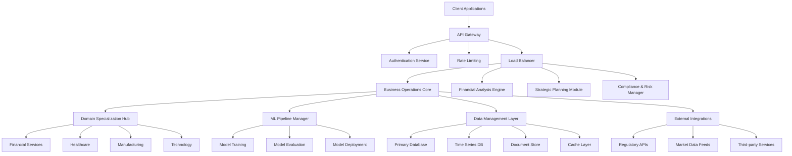
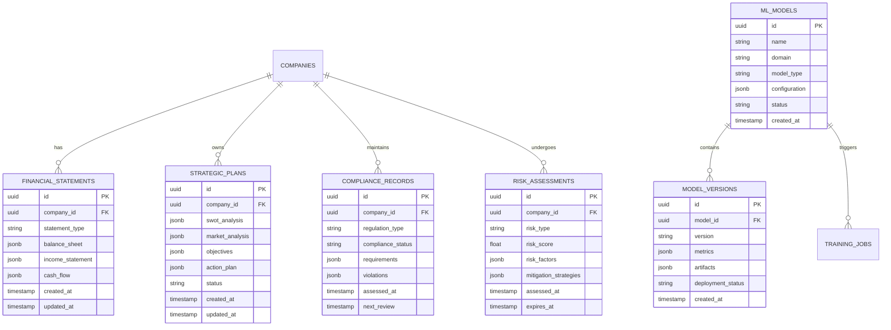
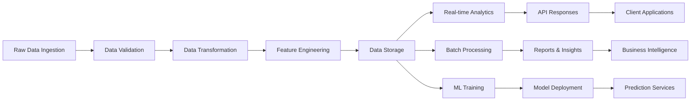
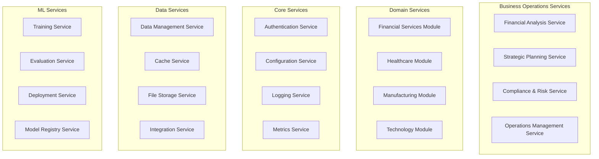
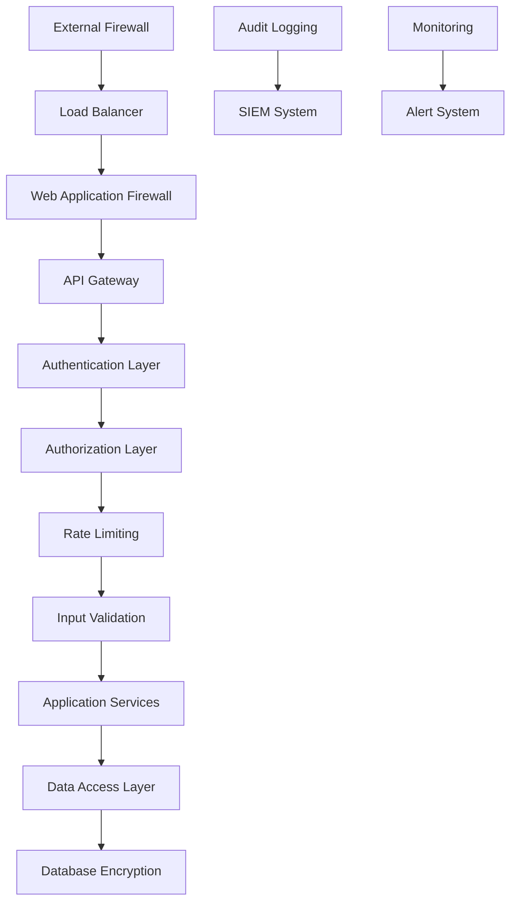
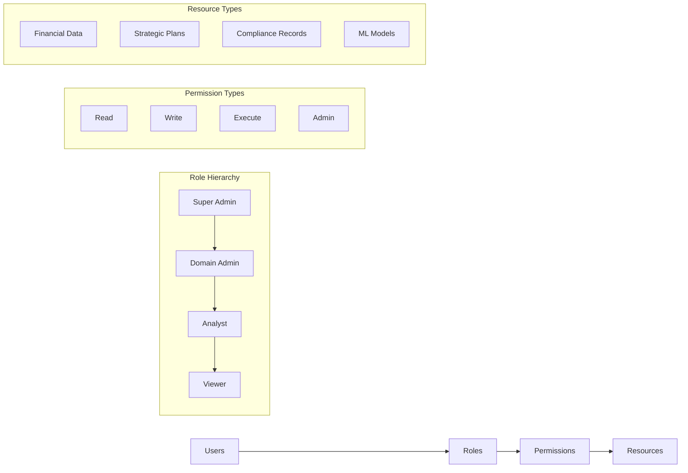
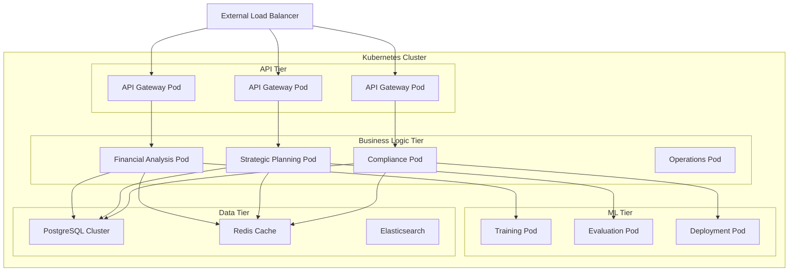
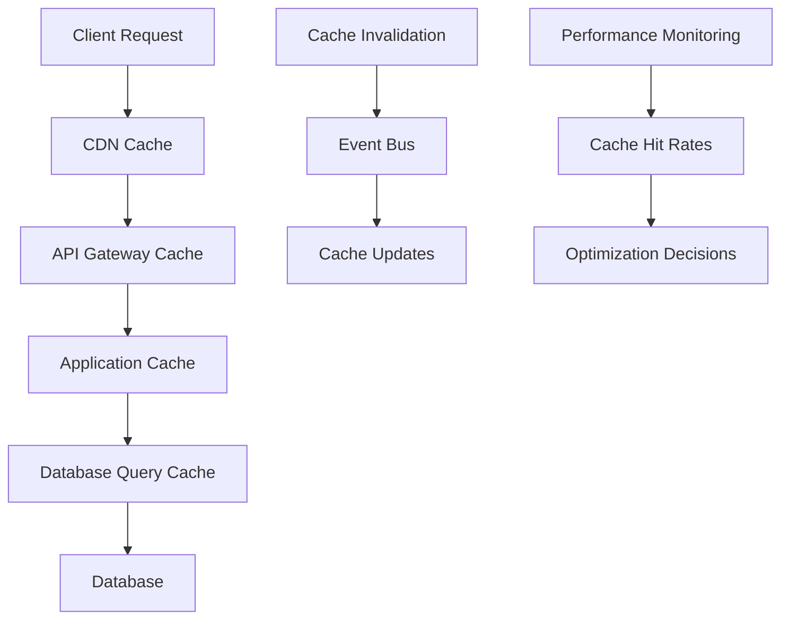
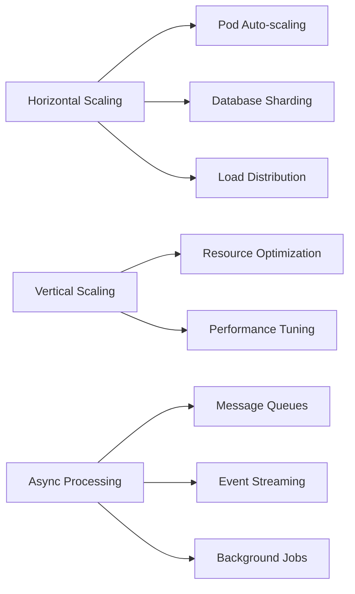
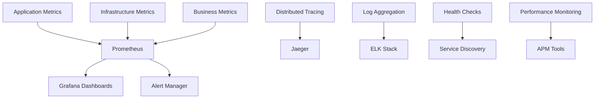

# Business Operations Architecture Overview

## System Architecture

### High-Level Architecture



### Core Components

#### 1. API Gateway Layer
- **Entry Point**: Single entry point for all business operations requests
- **Authentication**: JWT-based authentication with role-based access control
- **Rate Limiting**: Configurable rate limiting per client and endpoint
- **Request Routing**: Intelligent routing to appropriate service components

#### 2. Business Operations Core
- **Central Orchestrator**: Coordinates all business operation workflows
- **Service Registry**: Dynamic service discovery and health monitoring
- **Event Bus**: Asynchronous communication between components
- **Configuration Manager**: Centralized configuration management

#### 3. Domain Specialization Hub
- **Modular Architecture**: Pluggable domain-specific modules
- **Industry Adapters**: Specialized interfaces for different industries
- **Regulatory Engines**: Industry-specific compliance and regulatory modules
- **Custom Workflows**: Configurable business process workflows

#### 4. ML Pipeline Manager
- **Training Orchestrator**: Manages model training workflows
- **Model Registry**: Centralized model versioning and metadata
- **Evaluation Framework**: Automated model performance evaluation
- **Deployment Engine**: Automated model deployment and rollback

### Data Architecture

#### Database Schema Design



#### Data Flow Architecture



### Service Architecture

#### Microservices Design



### Security Architecture

#### Security Layers



#### Access Control Model



### Deployment Architecture

#### Container Architecture



### Performance Architecture

#### Caching Strategy



#### Scalability Patterns



## Design Patterns

### 1. Domain-Driven Design (DDD)
- **Bounded Contexts**: Clear boundaries between business domains
- **Aggregates**: Consistent business entities and operations
- **Value Objects**: Immutable business concepts
- **Domain Services**: Business logic encapsulation

### 2. Event-Driven Architecture
- **Event Sourcing**: Complete audit trail of business events
- **CQRS**: Separate read and write models for optimization
- **Event Bus**: Decoupled communication between services
- **Saga Pattern**: Distributed transaction management

### 3. Circuit Breaker Pattern
- **Failure Detection**: Automatic detection of service failures
- **Graceful Degradation**: Fallback mechanisms for resilience
- **Recovery Monitoring**: Automatic recovery detection
- **Health Checks**: Continuous service health monitoring

### 4. Repository Pattern
- **Data Abstraction**: Clean separation between business logic and data
- **Testing Support**: Easy mocking for unit tests
- **Multiple Data Sources**: Support for various storage backends
- **Query Optimization**: Efficient data access patterns

## Configuration Management

### Environment Configuration

```yaml
# config/environments/production.yaml
database:
  primary:
    host: "${DATABASE_HOST}"
    port: "${DATABASE_PORT}"
    name: "${DATABASE_NAME}"
    ssl_mode: "require"
    
  cache:
    redis_url: "${REDIS_URL}"
    ttl: 3600
    
api:
  rate_limits:
    default: 1000
    premium: 10000
    
ml:
  training:
    batch_size: 32
    learning_rate: 0.001
    max_epochs: 100
    
security:
  jwt:
    secret_key: "${JWT_SECRET_KEY}"
    expiration: 3600
    
  encryption:
    algorithm: "AES-256-GCM"
    key_rotation_days: 90
```

### Feature Flags

```yaml
# config/feature_flags.yaml
features:
  advanced_analytics:
    enabled: true
    rollout_percentage: 100
    
  experimental_ml_models:
    enabled: false
    rollout_percentage: 0
    whitelist: ["premium_customers"]
    
  enhanced_compliance:
    enabled: true
    rollout_percentage: 75
    gradual_rollout: true
```

## Monitoring & Observability

### Metrics Collection



### Key Performance Indicators (KPIs)

| Metric Category | Key Metrics | Target Values |
|----------------|-------------|---------------|
| **Performance** | Response Time, Throughput, Error Rate | <2s, >1000 RPS, <0.1% |
| **Availability** | Uptime, MTTR, MTBF | >99.9%, <15min, >720h |
| **Business** | Active Users, API Calls, Revenue | Growing, Stable, Positive |
| **Quality** | Model Accuracy, Precision, Recall | >95%, >90%, >90% |

---

This architecture overview provides the foundation for understanding how the business operations module is structured, designed, and deployed. The modular, scalable architecture ensures high performance, reliability, and maintainability while supporting complex business requirements across multiple industries.
