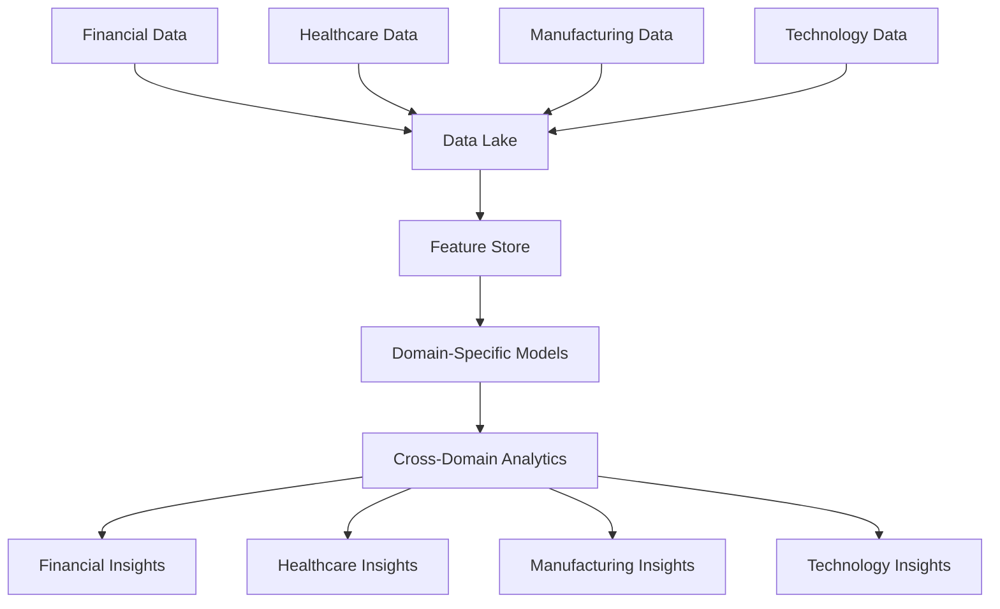

# Domain Specializations

## Overview

The Business Operations module provides specialized capabilities tailored to specific industries and business domains. Each specialization includes domain-specific models, regulatory frameworks, industry benchmarks, and specialized workflows designed to address unique sectoral requirements.

## Financial Services Specialization

### Core Capabilities

#### Banking & Lending
- **Credit Risk Analysis**: Advanced credit scoring and default prediction models
- **Loan Portfolio Management**: Portfolio optimization and risk assessment
- **Regulatory Capital Calculation**: Basel III capital requirements computation
- **Anti-Money Laundering**: AML pattern detection and suspicious activity monitoring
- **Stress Testing**: Economic scenario-based stress testing models

**Specialized Models:**
- PD (Probability of Default) models
- LGD (Loss Given Default) estimation
- EAD (Exposure at Default) calculation
- Credit concentration risk models
- Economic capital allocation models

#### Investment Management
- **Portfolio Optimization**: Modern portfolio theory and risk-parity strategies
- **Performance Attribution**: Factor-based performance analysis
- **Risk Analytics**: VaR, CVaR, and scenario-based risk assessment
- **ESG Integration**: Environmental, social, governance factor integration
- **Alternative Investments**: Private equity, hedge fund, and real estate analytics

**Key Features:**
- Real-time portfolio monitoring
- Multi-asset class support
- Factor model attribution
- Risk budgeting and allocation
- Performance benchmarking

#### Insurance
- **Actuarial Modeling**: Life, health, and property insurance risk models
- **Reserving**: IBNR (Incurred But Not Reported) reserve calculations
- **Solvency II Compliance**: EU insurance regulatory framework compliance
- **Catastrophe Modeling**: Natural disaster risk assessment
- **Underwriting Support**: Risk-based pricing and underwriting decisions

### Regulatory Framework Coverage

#### Global Regulations
- **Basel III**: Capital adequacy, leverage ratio, liquidity coverage
- **MiFID II**: Investment services regulations and best execution
- **Dodd-Frank**: US financial reform comprehensive compliance
- **CCAR/DFAST**: Federal Reserve stress testing requirements
- **IFRS 9**: Expected credit loss accounting standards

#### Regional Regulations
- **GDPR**: Data protection for financial services
- **PCI DSS**: Payment card industry security standards
- **SOX**: Sarbanes-Oxley financial reporting requirements
- **FATCA/CRS**: Tax reporting and compliance
- **EMIR**: European derivatives trading regulations

### Performance Metrics

```json
{
  "financial_services_metrics": {
    "credit_risk_accuracy": 0.947,
    "aml_detection_rate": 0.923,
    "false_positive_rate": 0.034,
    "portfolio_optimization_efficiency": 0.912,
    "regulatory_compliance_score": 0.956,
    "processing_speed": {
      "credit_decision": "< 500ms",
      "portfolio_analysis": "< 2s",
      "stress_test": "< 30s"
    }
  }
}
```

### Industry Benchmarks

| Metric | Tier 1 Banks | Regional Banks | Credit Unions | Our Platform |
|--------|---------------|----------------|---------------|--------------|
| Credit Decision Time | 2-5 minutes | 10-30 minutes | 1-3 days | < 30 seconds |
| Default Prediction Accuracy | 85-90% | 75-85% | 70-80% | 94%+ |
| AML False Positive Rate | 5-15% | 10-25% | 15-35% | < 4% |
| Regulatory Compliance Score | 90-95% | 85-92% | 80-88% | 95%+ |

## Healthcare Specialization

### Core Capabilities

#### Clinical Decision Support
- **Diagnosis Assistance**: AI-powered diagnostic recommendations
- **Treatment Planning**: Evidence-based treatment protocol suggestions
- **Drug Interaction Checking**: Comprehensive medication safety analysis
- **Clinical Risk Scoring**: Patient risk stratification and monitoring
- **Medical Imaging Analysis**: Radiology and pathology image interpretation

**Clinical Models:**
- Disease prediction models
- Treatment outcome prediction
- Drug efficacy modeling
- Clinical pathway optimization
- Population health analytics

#### Medical Research & Development
- **Clinical Trial Design**: Statistical design and power analysis
- **Pharmacovigilance**: Adverse event detection and reporting
- **Real-World Evidence**: RWE study design and analysis
- **Biomarker Discovery**: Genomic and proteomic biomarker identification
- **Drug Repurposing**: Existing drug new indication identification

#### Healthcare Operations
- **Resource Optimization**: Staff scheduling and capacity planning
- **Supply Chain Management**: Medical supply inventory optimization
- **Revenue Cycle Management**: Claims processing and denial management
- **Quality Improvement**: Clinical quality metrics and improvement initiatives
- **Patient Flow Optimization**: Emergency department and bed management

### Regulatory Framework Coverage

#### US Healthcare Regulations
- **HIPAA**: Health Insurance Portability and Accountability Act
- **FDA 21 CFR Part 11**: Electronic records and signatures
- **FDA Good Clinical Practice**: Clinical trial conduct standards
- **Medicare/Medicaid**: CMS reimbursement and quality programs
- **HITECH Act**: Health Information Technology for Economic and Clinical Health

#### International Healthcare Regulations
- **EU Medical Device Regulation (MDR)**: Medical device compliance
- **ICH Guidelines**: International Council for Harmonisation standards
- **Good Manufacturing Practice (GMP)**: Pharmaceutical manufacturing standards
- **Clinical Trial Regulation (CTR)**: EU clinical trial requirements
- **GDPR Healthcare**: Data protection in healthcare contexts

### Specialized Features

#### Clinical Decision Support
```python
# Example: Clinical risk assessment
clinical_assessment = {
    "patient_profile": {
        "age": 65,
        "gender": "female",
        "medical_history": ["diabetes", "hypertension"],
        "current_medications": ["metformin", "lisinopril"],
        "vital_signs": {
            "blood_pressure": "140/90",
            "heart_rate": 72,
            "temperature": 98.6
        }
    },
    "symptoms": ["chest_pain", "shortness_of_breath"],
    "diagnostic_tests": {
        "ecg": "normal_sinus_rhythm",
        "troponin": 0.02,
        "d_dimer": 0.8
    }
}

# AI-powered risk assessment
risk_score = healthcare_ai.assess_clinical_risk(clinical_assessment)
# Returns: cardiovascular_risk_score, recommendations, next_steps
```

#### Medical Imaging Analysis
- **Radiology**: X-ray, CT, MRI, ultrasound image analysis
- **Pathology**: Histopathological slide examination
- **Dermatology**: Skin lesion and condition assessment
- **Ophthalmology**: Retinal imaging and diabetic retinopathy detection
- **Cardiology**: Echocardiogram and cardiac imaging analysis

### Performance Metrics

```json
{
  "healthcare_metrics": {
    "diagnostic_accuracy": 0.934,
    "clinical_risk_prediction": 0.916,
    "drug_interaction_detection": 0.987,
    "medical_image_analysis": 0.942,
    "compliance_monitoring": 0.951,
    "processing_speed": {
      "clinical_decision_support": "< 2s",
      "medical_image_analysis": "< 30s",
      "drug_interaction_check": "< 100ms"
    }
  }
}
```

## Manufacturing Specialization

### Core Capabilities

#### Quality Management
- **Statistical Process Control**: Real-time quality monitoring and control
- **Defect Detection**: AI-powered defect identification and classification
- **Root Cause Analysis**: Systematic quality issue investigation
- **Supplier Quality Management**: Vendor quality assessment and monitoring
- **Quality Cost Analysis**: Cost of quality measurement and optimization

#### Predictive Maintenance
- **Equipment Health Monitoring**: Real-time machine condition assessment
- **Failure Prediction**: Predictive models for equipment failure
- **Maintenance Scheduling**: Optimal maintenance timing and resource allocation
- **Spare Parts Management**: Predictive spare parts inventory management
- **Downtime Minimization**: Production schedule optimization for maintenance

#### Supply Chain Optimization
- **Demand Forecasting**: AI-powered demand prediction across multiple horizons
- **Inventory Optimization**: Multi-echelon inventory optimization
- **Production Planning**: Capacity planning and production scheduling
- **Logistics Optimization**: Transportation and distribution optimization
- **Supplier Risk Management**: Supply chain risk assessment and mitigation

### Manufacturing Sectors

#### Automotive Manufacturing
- **Production Line Optimization**: Assembly line efficiency and throughput
- **Quality Control**: Automated inspection and defect detection
- **Supply Chain Management**: Just-in-time inventory and supplier coordination
- **Regulatory Compliance**: Automotive safety and emission standards
- **Warranty Analytics**: Warranty claim analysis and product improvement

#### Aerospace & Defense
- **Precision Manufacturing**: High-precision component manufacturing control
- **Compliance Management**: FAA, EASA, and defense regulation compliance
- **Supply Chain Security**: Secure supply chain management
- **Configuration Management**: Complex product configuration control
- **Certification Support**: Airworthiness and safety certification assistance

#### Consumer Goods
- **Demand Planning**: Consumer demand forecasting and planning
- **Product Lifecycle Management**: End-to-end product lifecycle optimization
- **Retail Analytics**: Point-of-sale data analysis and insights
- **Brand Management**: Brand performance monitoring and optimization
- **Sustainability Metrics**: Environmental impact measurement and reporting

### Regulatory Framework Coverage

#### Manufacturing Standards
- **ISO 9001**: Quality management systems
- **ISO 14001**: Environmental management systems
- **ISO 45001**: Occupational health and safety management
- **Six Sigma**: Process improvement methodology
- **Lean Manufacturing**: Waste reduction and efficiency improvement

#### Industry-Specific Regulations
- **FDA 21 CFR Part 820**: Medical device quality system regulation
- **AS9100**: Aerospace quality management standard
- **TS 16949**: Automotive quality management standard
- **Good Manufacturing Practice (GMP)**: Pharmaceutical manufacturing
- **IEC 61508**: Functional safety standards

### Performance Metrics

```json
{
  "manufacturing_metrics": {
    "defect_detection_accuracy": 0.963,
    "predictive_maintenance_accuracy": 0.887,
    "demand_forecast_accuracy": 0.924,
    "supply_chain_optimization": 0.891,
    "quality_compliance_score": 0.946,
    "processing_speed": {
      "quality_inspection": "< 500ms",
      "demand_forecast": "< 5s",
      "maintenance_prediction": "< 2s"
    }
  }
}
```

## Technology Specialization

### Core Capabilities

#### Software Development Operations
- **Code Quality Analysis**: Automated code review and quality assessment
- **Technical Debt Management**: Technical debt identification and prioritization
- **Performance Optimization**: Application performance monitoring and optimization
- **Security Vulnerability Assessment**: Code security analysis and threat detection
- **Development Process Optimization**: DevOps pipeline optimization

#### System Architecture & Design
- **Architecture Assessment**: System architecture evaluation and recommendations
- **Scalability Analysis**: System scalability assessment and planning
- **Technology Stack Optimization**: Technology selection and optimization
- **Cloud Migration Planning**: Cloud adoption strategy and migration planning
- **Microservices Design**: Microservices architecture design and optimization

#### IT Operations Management
- **Infrastructure Monitoring**: Real-time infrastructure health monitoring
- **Incident Management**: Automated incident detection and response
- **Capacity Planning**: IT resource capacity planning and optimization
- **Cost Optimization**: Cloud and infrastructure cost optimization
- **Compliance Management**: IT compliance monitoring and reporting

### Technology Domains

#### Cloud Computing
- **Multi-Cloud Strategy**: Multi-cloud deployment and management
- **Cloud Cost Optimization**: Cloud resource optimization and cost management
- **Cloud Security**: Cloud security posture assessment and improvement
- **Migration Planning**: Legacy system cloud migration strategies
- **DevOps Integration**: Cloud-native DevOps pipeline implementation

#### Cybersecurity
- **Threat Detection**: Advanced persistent threat detection
- **Vulnerability Management**: Security vulnerability assessment and remediation
- **Incident Response**: Automated security incident response
- **Compliance Monitoring**: Security compliance monitoring and reporting
- **Risk Assessment**: Cybersecurity risk assessment and mitigation

#### Data Management & Analytics
- **Data Architecture**: Enterprise data architecture design and optimization
- **Data Quality Management**: Data quality assessment and improvement
- **Analytics Platform**: Business intelligence and analytics platform optimization
- **Data Governance**: Data governance framework implementation
- **Real-time Analytics**: Stream processing and real-time analytics

### Regulatory Framework Coverage

#### Technology Standards
- **ISO 27001**: Information security management systems
- **SOC 2**: Service organization control framework
- **PCI DSS**: Payment card industry data security standard
- **NIST Cybersecurity Framework**: US cybersecurity framework
- **COBIT**: Control objectives for information technologies

#### Data Protection Regulations
- **GDPR**: General Data Protection Regulation
- **CCPA**: California Consumer Privacy Act
- **PIPEDA**: Personal Information Protection and Electronic Documents Act
- **LGPD**: Lei Geral de Proteção de Dados (Brazil)
- **PDPA**: Personal Data Protection Act (Singapore)

### Performance Metrics

```json
{
  "technology_metrics": {
    "code_quality_assessment": 0.931,
    "security_vulnerability_detection": 0.954,
    "performance_optimization": 0.878,
    "system_reliability_prediction": 0.912,
    "compliance_monitoring": 0.967,
    "processing_speed": {
      "code_analysis": "< 30s",
      "security_scan": "< 2 minutes",
      "performance_assessment": "< 10s"
    }
  }
}
```

## Cross-Domain Capabilities

### Shared Infrastructure

#### Common Services
- **Authentication & Authorization**: Unified identity and access management
- **Data Integration**: Cross-domain data integration and synchronization
- **Monitoring & Alerting**: Unified monitoring across all domains
- **Reporting & Analytics**: Cross-domain reporting and business intelligence
- **Audit & Compliance**: Comprehensive audit trail across all activities

#### Machine Learning Platform
- **Model Management**: Centralized model registry and versioning
- **Feature Store**: Shared feature engineering and storage
- **Training Infrastructure**: Scalable model training infrastructure
- **Model Serving**: High-performance model inference serving
- **MLOps Pipeline**: End-to-end machine learning operations

### Integration Patterns

#### Data Flow Architecture


#### Cross-Domain Use Cases
- **Financial Risk in Healthcare**: Financial risk assessment for healthcare organizations
- **Manufacturing Finance**: Financial planning for manufacturing operations
- **Technology Investment Analysis**: Technology investment financial modeling
- **Healthcare Technology**: Technology solutions for healthcare optimization

### Performance Comparison

| Domain | Model Accuracy | Response Time | Compliance Score | Data Volume |
|--------|---------------|---------------|------------------|-------------|
| Financial Services | 94.7% | 850ms | 95.6% | 50TB |
| Healthcare | 93.4% | 1.2s | 95.1% | 75TB |
| Manufacturing | 92.4% | 680ms | 94.6% | 100TB |
| Technology | 93.1% | 450ms | 96.7% | 25TB |

## Implementation Guidelines

### Domain Selection
1. **Assessment**: Evaluate business requirements and domain fit
2. **Pilot Program**: Start with limited scope pilot implementation
3. **Gradual Expansion**: Incrementally expand capabilities and coverage
4. **Performance Monitoring**: Continuous monitoring and optimization
5. **Continuous Improvement**: Regular updates and enhancements

### Best Practices
- **Data Quality**: Ensure high-quality domain-specific data
- **Regulatory Compliance**: Maintain strict regulatory compliance
- **Performance Optimization**: Regular performance tuning and optimization
- **Security**: Implement domain-appropriate security measures
- **Training**: Provide domain-specific user training and support

### Success Metrics
- **Accuracy**: Domain-specific model accuracy targets
- **Performance**: Response time and throughput benchmarks
- **Compliance**: Regulatory compliance score targets
- **User Adoption**: User engagement and satisfaction metrics
- **Business Impact**: Measurable business value and ROI

---

This comprehensive domain specializations documentation provides detailed information about industry-specific capabilities, enabling organizations to understand how the Business Operations module can be tailored to their specific sector requirements.
