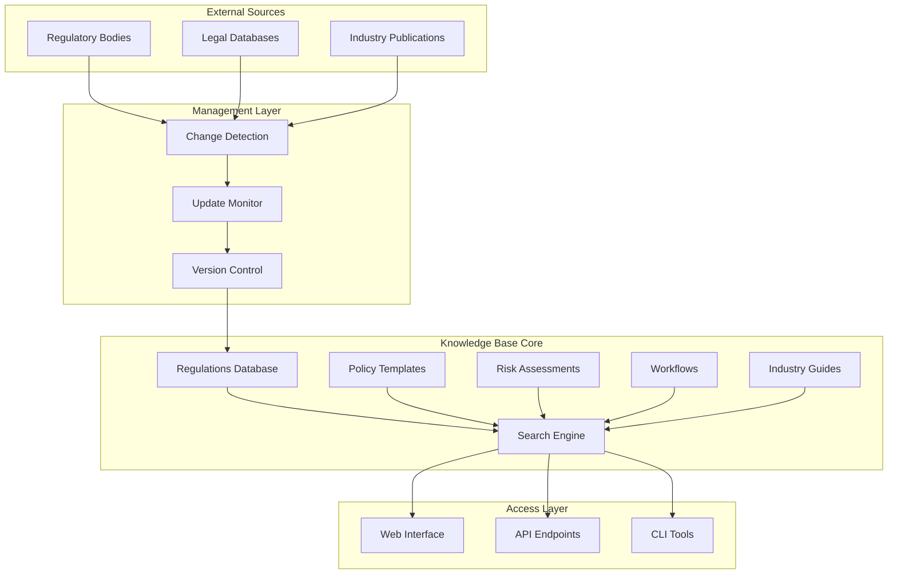

# Compliance Knowledge Base

## Overview

The Frontier Compliance Knowledge Base is a comprehensive repository of regulatory information, compliance requirements, policies, and procedures designed to help organizations maintain regulatory compliance across multiple jurisdictions and industries.

## Features

- **Regulatory Database**: Detailed information on 50+ regulations across multiple jurisdictions
- **Search Functionality**: Advanced search with filtering by regulation, jurisdiction, industry, and compliance type
- **Version Tracking**: Complete audit trail of regulatory updates and changes
- **Policy Templates**: Ready-to-use policy document templates
- **Risk Assessment Tools**: Methodologies and frameworks for compliance risk assessment
- **Workflow Documentation**: Step-by-step compliance processes
- **Industry Guides**: Sector-specific compliance requirements and best practices

## Quick Start

```python
from knowledge_base.compliance import ComplianceKnowledgeBase

# Initialize knowledge base
kb = ComplianceKnowledgeBase()

# Search for regulations
results = kb.search_regulations(
    query="data protection",
    jurisdiction="EU",
    industry="financial_services"
)

# Get regulation details
gdpr_info = kb.get_regulation_details("GDPR")

# Get policy template
policy = kb.get_policy_template("data_protection", "EU")
```

## Navigation

### Core Documentation
- [Regulations Database](./regulations/README.md) - Complete regulatory information
- [Jurisdictions](./jurisdictions/README.md) - Jurisdiction-specific requirements
- [Policy Templates](./policies/README.md) - Document templates and examples
- [Risk Assessment](./risk_assessment/README.md) - Assessment methodologies
- [Workflows](./workflows/README.md) - Compliance processes
- [Updates](./updates/README.md) - Regulatory update procedures
- [Industry Guides](./industry_guides/README.md) - Sector-specific compliance

### Tools and Systems
- [Search System](./tools/search_system.py) - Advanced search functionality
- [Version Control](./tools/version_control.py) - Update tracking system
- [Knowledge Base API](./api/knowledge_base_api.py) - Programmatic access
- [Update Monitor](./tools/update_monitor.py) - Regulatory change detection

## System Architecture



## Quick Reference

### Supported Regulations
- **Data Protection**: GDPR, CCPA, PIPEDA, DPA 2018
- **Financial Services**: SOX, Dodd-Frank, MiFID II, Basel III
- **Healthcare**: HIPAA, FDA 21 CFR Part 11, MDR
- **Industry Standards**: ISO 27001, SOC 2, PCI DSS

### Supported Jurisdictions
- **Europe**: EU, UK, Germany, France, Netherlands
- **North America**: USA, Canada, Mexico
- **Asia Pacific**: Australia, Singapore, Japan, Hong Kong
- **Other**: Brazil, Switzerland, South Africa

### Industries Covered
- Financial Services
- Healthcare & Life Sciences
- Technology & Software
- Manufacturing
- Retail & E-commerce
- Energy & Utilities

## Getting Help

- **Documentation**: Check specific module documentation
- **Search**: Use the search functionality for quick lookups
- **Support**: Contact compliance@frontier.ai
- **Updates**: Subscribe to regulatory update notifications

## Version Information

- **Knowledge Base Version**: 2.1.0
- **Last Updated**: 2025-01-15
- **Regulations Count**: 187
- **Policy Templates**: 95
- **Jurisdictions**: 45
- **Industry Guides**: 12

---

*For detailed information on any component, please refer to the specific documentation in each module.*
