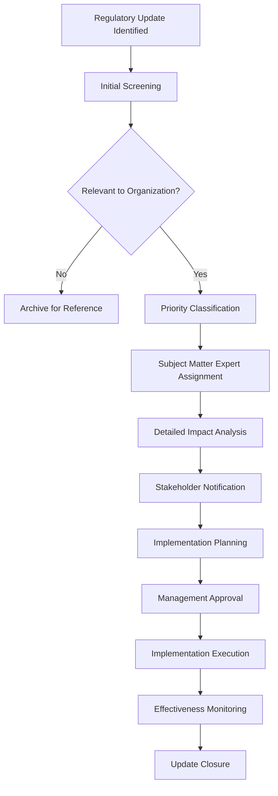

# Regulatory Update Procedures

## Overview

Comprehensive procedures for monitoring, analyzing, and implementing regulatory updates across all supported jurisdictions and regulations. This system ensures timely identification, assessment, and implementation of regulatory changes to maintain continuous compliance.

## Update Monitoring Framework

### Monitoring Sources

#### Primary Regulatory Sources
```
European Union:
□ Official Journal of the European Union
□ European Data Protection Board (EDPB)
□ European Securities and Markets Authority (ESMA)
□ European Medicines Agency (EMA)
□ National supervisory authorities

United States:
□ Federal Register
□ Securities and Exchange Commission (SEC)
□ Department of Health and Human Services (HHS)
□ Federal Trade Commission (FTC)
□ State attorney general offices

Canada:
□ Canada Gazette
□ Office of the Privacy Commissioner
□ Office of the Superintendent of Financial Institutions (OSFI)
□ Provincial regulatory bodies

Asia-Pacific:
□ Personal Data Protection Commission (Singapore)
□ Office of the Australian Information Commissioner
□ Personal Information Protection Commission (Japan)
□ Privacy Commissioner for Personal Data (Hong Kong)
```

#### Secondary Intelligence Sources
```
Legal Databases:
□ Westlaw
□ LexisNexis
□ Bloomberg Law
□ Thomson Reuters

Industry Publications:
□ IAPP Privacy Advisor
□ Compliance Week
□ Risk.net
□ Healthcare Finance News

Professional Networks:
□ International Association of Privacy Professionals (IAPP)
□ Society of Corporate Compliance and Ethics (SCCE)
□ Association of Certified Fraud Examiners (ACFE)
□ Information Systems Audit and Control Association (ISACA)
```

### Automated Monitoring System

#### RSS Feed Monitoring
```python
class RegulatoryUpdateMonitor:
    """
    Automated monitoring system for regulatory updates
    """
    
    def __init__(self):
        self.feed_sources = {
            'eu_official_journal': 'https://eur-lex.europa.eu/oj/rss.xml',
            'federal_register': 'https://www.federalregister.gov/documents.rss',
            'sec_releases': 'https://www.sec.gov/rss/litigation/litreleases.xml',
            'edpb_news': 'https://edpb.europa.eu/rss.xml',
            'privacy_commissioner_ca': 'https://www.priv.gc.ca/rss/index_e.xml'
        }
        
    def monitor_feeds(self):
        """Monitor all configured RSS feeds for updates"""
        updates = []
        
        for source, url in self.feed_sources.items():
            try:
                feed_updates = self.parse_feed(url, source)
                updates.extend(feed_updates)
                
            except Exception as e:
                self.log_error(f"Error monitoring {source}: {str(e)}")
                
        return self.process_updates(updates)
    
    def parse_feed(self, url, source):
        """Parse RSS feed and extract relevant updates"""
        import feedparser
        
        feed = feedparser.parse(url)
        updates = []
        
        for entry in feed.entries:
            update = {
                'source': source,
                'title': entry.title,
                'link': entry.link,
                'published': entry.published,
                'summary': entry.summary,
                'relevance_score': self.calculate_relevance(entry),
                'regulation_tags': self.extract_regulation_tags(entry)
            }
            
            if update['relevance_score'] > 0.5:  # Relevance threshold
                updates.append(update)
                
        return updates
    
    def calculate_relevance(self, entry):
        """Calculate relevance score based on keywords and context"""
        keywords = [
            'gdpr', 'privacy', 'data protection', 'sox', 'sarbanes-oxley',
            'hipaa', 'healthcare', 'financial services', 'cybersecurity',
            'compliance', 'regulation', 'directive', 'enforcement'
        ]
        
        text = f"{entry.title} {entry.summary}".lower()
        score = sum(1 for keyword in keywords if keyword in text)
        
        return min(score / len(keywords), 1.0)
```

#### Email Alert System
```python
class AlertSystem:
    """
    Email alert system for regulatory updates
    """
    
    def __init__(self):
        self.subscribers = {
            'critical': ['dpo@company.com', 'cco@company.com', 'ciso@company.com'],
            'high': ['compliance-team@company.com'],
            'medium': ['legal-team@company.com'],
            'low': ['all-staff@company.com']
        }
    
    def send_alert(self, update, priority):
        """Send alert based on update priority"""
        recipients = []
        
        # Add recipients based on priority
        for level in ['critical', 'high', 'medium', 'low']:
            recipients.extend(self.subscribers[level])
            if level == priority:
                break
        
        subject = f"[{priority.upper()}] Regulatory Update: {update['title']}"
        
        body = self.format_alert_email(update, priority)
        
        self.send_email(recipients, subject, body)
    
    def format_alert_email(self, update, priority):
        """Format alert email content"""
        return f"""
        Regulatory Update Alert - Priority: {priority.upper()}
        
        Title: {update['title']}
        Source: {update['source']}
        Published: {update['published']}
        Link: {update['link']}
        
        Summary:
        {update['summary']}
        
        Affected Regulations: {', '.join(update['regulation_tags'])}
        
        Next Steps:
        1. Review full update details
        2. Assess impact on current compliance program
        3. Update internal procedures if necessary
        4. Notify relevant stakeholders
        
        For questions, contact the Compliance Team.
        """
```

## Update Assessment Process

### Impact Assessment Workflow



### Priority Classification Matrix

| Impact Level | Urgency | Priority | Response Time | Examples |
|--------------|---------|----------|---------------|----------|
| High | High | Critical | 24 hours | New enforcement actions, material penalties |
| High | Medium | High | 3 days | Significant regulation changes, new requirements |
| Medium | High | High | 3 days | Clarification of existing requirements with immediate effect |
| Medium | Medium | Medium | 1 week | Guidance updates, non-material changes |
| Low | Medium | Medium | 2 weeks | Industry best practices, informational updates |
| Low | Low | Low | 1 month | General industry news, future planning |

### Impact Assessment Template

```
Update ID: [Unique Identifier]
Date Identified: [Date]
Source: [Regulatory Body/Publication]
Priority: [Critical/High/Medium/Low]

Update Summary:
[Brief description of the regulatory update]

Affected Regulations:
□ GDPR
□ CCPA
□ SOX
□ HIPAA
□ ISO 27001
□ Other: [Specify]

Jurisdiction Impact:
□ European Union
□ United States
□ Canada
□ Asia-Pacific
□ Global
□ Other: [Specify]

Business Impact Assessment:
1. Scope of Impact:
   □ Entire organization
   □ Specific departments: [List]
   □ Specific processes: [List]
   □ Specific systems: [List]

2. Financial Impact:
   □ No financial impact
   □ <$10,000
   □ $10,000 - $100,000
   □ $100,000 - $1,000,000
   □ >$1,000,000

3. Operational Impact:
   □ No operational changes required
   □ Minor process adjustments
   □ Significant process changes
   □ New process implementation
   □ System modifications required

4. Risk Assessment:
   □ No compliance risk
   □ Low risk of non-compliance
   □ Medium risk of non-compliance
   □ High risk of non-compliance
   □ Critical compliance gap

Implementation Requirements:
1. Policy Updates Required:
   [List policies requiring updates]

2. Procedure Changes:
   [List procedure modifications]

3. Training Needs:
   [Identify training requirements]

4. System Changes:
   [List technical modifications needed]

5. Resource Requirements:
   - Personnel: [Number and roles]
   - Budget: [Estimated cost]
   - Timeline: [Implementation schedule]

Stakeholder Notifications:
□ Executive management
□ Board of directors
□ Compliance committee
□ Legal department
□ IT department
□ Business units
□ External counsel

Action Plan:
Task | Owner | Due Date | Status
[Implementation tasks]

Risk Mitigation:
[Describe interim measures if implementation is delayed]

Success Metrics:
[Define how implementation success will be measured]

Review Date: [Date for effectiveness review]
```

## Implementation Procedures

### Standard Operating Procedure for Update Implementation

#### Phase 1: Assessment and Planning (Days 1-7)

**Step 1: Initial Assessment**
```
Responsible: Compliance Officer
Timeline: 24-48 hours

Activities:
□ Review regulatory update details
□ Conduct preliminary impact assessment
□ Classify priority level
□ Assign subject matter expert
□ Create update tracking record
```

**Step 2: Detailed Analysis**
```
Responsible: Subject Matter Expert + Legal Team
Timeline: 3-5 days

Activities:
□ Analyze legal requirements in detail
□ Map to existing compliance framework
□ Identify gaps and required changes
□ Assess implementation complexity
□ Estimate resource requirements
□ Prepare impact assessment report
```

**Step 3: Stakeholder Consultation**
```
Responsible: Compliance Officer
Timeline: 2-3 days

Activities:
□ Share assessment with stakeholders
□ Gather input from affected departments
□ Validate impact analysis
□ Refine implementation approach
□ Secure initial stakeholder buy-in
```

#### Phase 2: Planning and Approval (Days 8-21)

**Step 4: Implementation Planning**
```
Responsible: Project Manager + Compliance Team
Timeline: 5-7 days

Activities:
□ Develop detailed implementation plan
□ Create project timeline and milestones
□ Identify required resources
□ Define roles and responsibilities
□ Establish communication plan
□ Prepare budget estimates
```

**Step 5: Management Approval**
```
Responsible: Executive Sponsor
Timeline: 3-5 days

Activities:
□ Present implementation plan to management
□ Secure budget approval
□ Obtain resource allocation approval
□ Confirm implementation timeline
□ Establish governance structure
```

**Step 6: Communication and Training Planning**
```
Responsible: Training Manager + Communications Team
Timeline: 3-5 days

Activities:
□ Develop communication strategy
□ Create training materials
□ Plan awareness campaigns
□ Schedule training sessions
□ Prepare change management activities
```

#### Phase 3: Implementation (Days 22-90)

**Step 7: Policy and Procedure Updates**
```
Responsible: Policy Owner + Legal Team
Timeline: 10-15 days

Activities:
□ Update affected policies
□ Revise procedures and work instructions
□ Create new documentation as needed
□ Conduct legal review
□ Obtain management approval
□ Publish updated documents
```

**Step 8: System and Process Changes**
```
Responsible: IT Team + Process Owners
Timeline: 30-45 days

Activities:
□ Implement system modifications
□ Update process workflows
□ Configure new controls
□ Test system changes
□ Conduct user acceptance testing
□ Deploy to production
```

**Step 9: Training and Awareness**
```
Responsible: Training Manager + HR
Timeline: 15-30 days

Activities:
□ Deliver training programs
□ Conduct awareness sessions
□ Distribute communications
□ Monitor training completion
□ Address questions and concerns
```

#### Phase 4: Validation and Monitoring (Days 91-120)

**Step 10: Implementation Validation**
```
Responsible: Internal Audit + Compliance Team
Timeline: 15-20 days

Activities:
□ Test new controls and procedures
□ Validate system configurations
□ Review training effectiveness
□ Assess implementation completeness
□ Document validation results
```

**Step 11: Ongoing Monitoring**
```
Responsible: Compliance Team
Timeline: Continuous

Activities:
□ Monitor compliance with new requirements
□ Track key performance indicators
□ Conduct regular assessments
□ Address implementation issues
□ Report to management
```

### Change Management Process

#### Stakeholder Communication Plan
```
Communication Matrix:

Executive Leadership:
- Frequency: Weekly during implementation
- Content: High-level status, issues, decisions needed
- Format: Executive dashboard, brief reports

Compliance Committee:
- Frequency: Bi-weekly
- Content: Detailed progress, risk assessment, resource needs
- Format: Committee presentations, detailed reports

Department Managers:
- Frequency: Weekly
- Content: Departmental impact, task assignments, timelines
- Format: Management meetings, action plans

All Staff:
- Frequency: Monthly
- Content: Awareness updates, training announcements
- Format: All-hands meetings, newsletters, intranet
```

#### Training and Awareness Program
```
Training Modules:

Module 1: Regulatory Overview
- Target: All staff
- Duration: 30 minutes
- Content: Background, importance, basic requirements

Module 2: Process Changes
- Target: Affected staff
- Duration: 2 hours
- Content: New procedures, workflows, responsibilities

Module 3: System Updates
- Target: System users
- Duration: 1 hour
- Content: New features, configurations, controls

Module 4: Compliance Monitoring
- Target: Compliance team
- Duration: 4 hours
- Content: Monitoring procedures, reporting, escalation
```

## Quality Assurance and Version Control

### Documentation Version Control
```
Version Control System:

Document Versioning:
- Major.Minor.Patch format (e.g., 2.1.3)
- Major: Significant regulatory changes
- Minor: Process improvements, clarifications
- Patch: Corrections, minor updates

Change Tracking:
□ Date of change
□ Nature of change
□ Reason for change
□ Approval authority
□ Implementation date

Archive Management:
□ Previous versions maintained
□ Access controls for historical documents
□ Retention schedule compliance
□ Regular archive cleanup
```

### Quality Review Process
```
Review Checkpoints:

Initial Review:
□ Accuracy of regulatory interpretation
□ Completeness of impact assessment
□ Appropriateness of response plan

Legal Review:
□ Legal compliance verification
□ Risk assessment validation
□ Regulatory interpretation accuracy

Management Review:
□ Business impact acceptability
□ Resource allocation appropriateness
□ Timeline feasibility

Final Review:
□ Implementation effectiveness
□ Documentation completeness
□ Training adequacy
```

## Performance Metrics and Reporting

### Key Performance Indicators (KPIs)
```
Timeliness Metrics:
□ Average time from update identification to assessment
□ Percentage of updates assessed within SLA
□ Implementation completion within planned timeline
□ Training completion rate

Quality Metrics:
□ Accuracy of impact assessments
□ Effectiveness of implementations
□ Stakeholder satisfaction scores
□ Audit finding related to updates

Efficiency Metrics:
□ Cost per update implementation
□ Resource utilization rates
□ Process automation percentage
□ Reusability of implementation components
```

### Management Reporting
```
Monthly Reports:
□ Update pipeline status
□ Implementation progress
□ Resource utilization
□ Risk assessments

Quarterly Reports:
□ Trend analysis
□ Process performance review
□ Stakeholder feedback summary
□ Improvement recommendations

Annual Reports:
□ Comprehensive program assessment
□ ROI analysis
□ Best practice documentation
□ Strategic planning updates
```

---

*For detailed update procedures and templates, see individual procedure files in the updates/ directory.*
