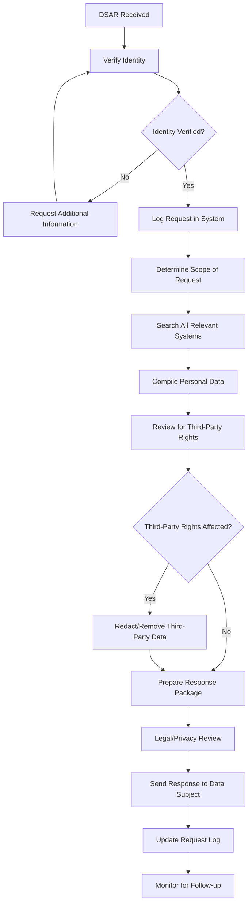
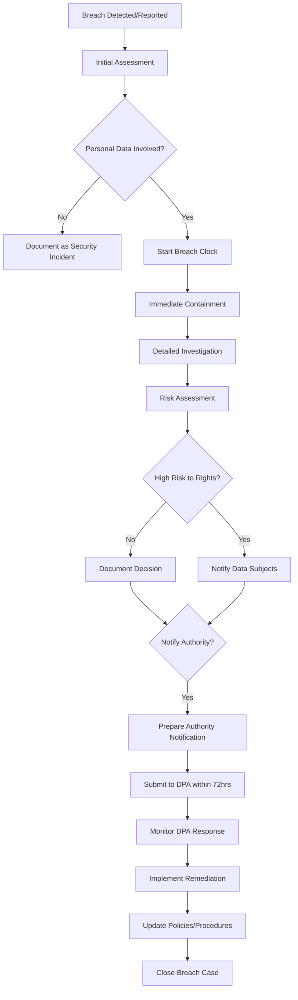
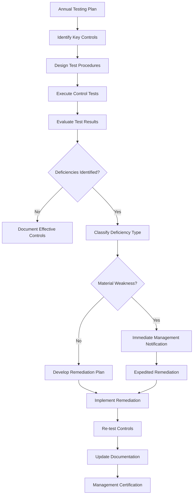
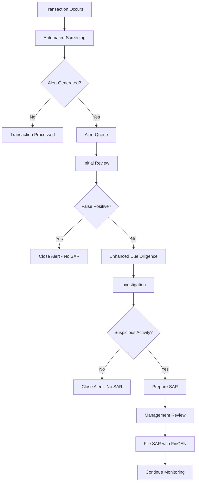
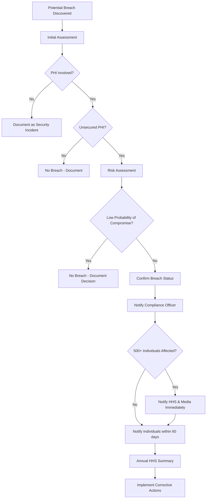
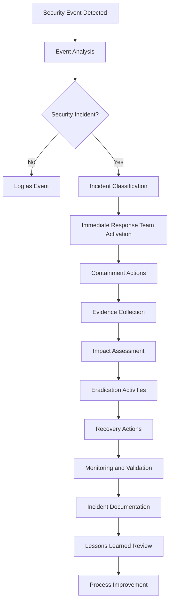
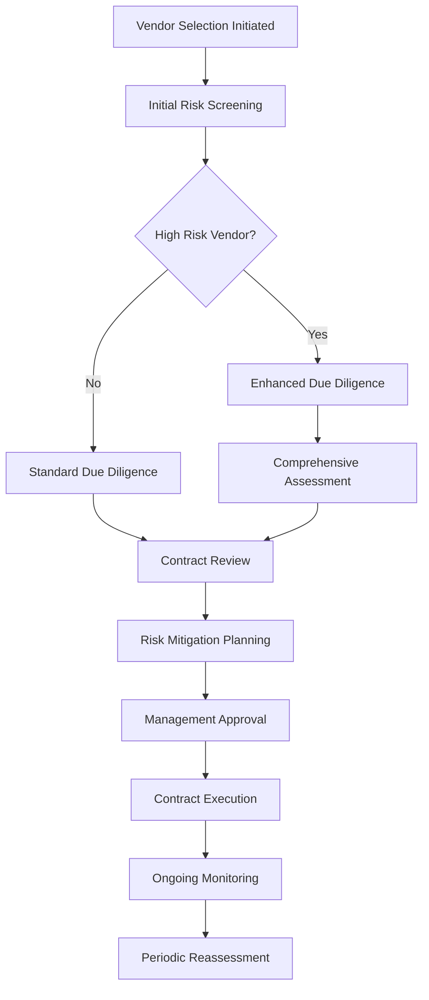
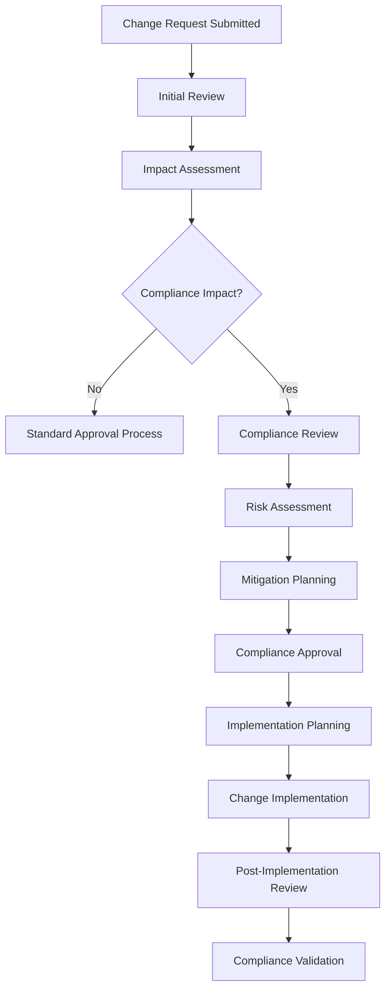

# Compliance Workflow Documentation

## Overview

Comprehensive documentation of compliance workflows, processes, and procedures across different regulatory frameworks. These workflows provide step-by-step guidance for implementing and maintaining compliance programs.

## Workflow Categories

### Data Protection Workflows

#### GDPR Data Subject Rights Workflow

**Workflow: Data Subject Access Request (DSAR)**



**Process Steps:**

**Step 1: Request Receipt and Initial Processing**
- **Timeline**: Within 24 hours
- **Responsible**: Data Protection Team
- **Actions**:
  - Log request in DSAR tracking system
  - Assign unique request ID
  - Send acknowledgment to data subject
  - Verify identity of requestor

**Step 2: Scope Determination and Data Location**
- **Timeline**: Within 3 business days
- **Responsible**: Data Protection Officer
- **Actions**:
  - Analyze request scope and complexity
  - Identify all systems containing personal data
  - Coordinate with system owners
  - Estimate response timeline

**Step 3: Data Compilation and Review**
- **Timeline**: Within 20 calendar days (unless extended)
- **Responsible**: System Owners + Data Protection Team
- **Actions**:
  - Extract relevant personal data
  - Review for accuracy and completeness
  - Identify third-party rights and confidential information
  - Apply appropriate redactions

**Step 4: Response Preparation and Delivery**
- **Timeline**: Within 30 calendar days total
- **Responsible**: Data Protection Officer
- **Actions**:
  - Prepare response in accessible format
  - Include explanation of processing activities
  - Provide information about data sources
  - Deliver response via secure method

**Quality Checkpoints:**
- Identity verification completed
- All relevant systems searched
- Third-party rights protected
- Response delivered within timeline
- Request properly documented

#### GDPR Data Breach Response Workflow



**Process Details:**

**Phase 1: Detection and Initial Response (0-1 hour)**
```
Immediate Actions:
□ Stop the breach if possible
□ Preserve evidence
□ Assess scope and nature
□ Notify DPO and incident response team
□ Start breach clock (72-hour timeline)
```

**Phase 2: Investigation and Assessment (1-24 hours)**
```
Investigation Tasks:
□ Determine cause of breach
□ Identify affected personal data
□ Assess number of data subjects affected
□ Evaluate potential consequences
□ Determine if breach is ongoing
□ Interview relevant personnel
□ Review system logs and evidence
```

**Phase 3: Risk Assessment (12-48 hours)**
```
Risk Evaluation Criteria:
□ Type and sensitivity of data involved
□ Number of individuals affected
□ Likelihood of identification
□ Potential for identity theft or fraud
□ Risk of discrimination or disadvantage
□ Risk of damage to reputation
□ Any other significant adverse effects
```

**Phase 4: Notification Decision (24-72 hours)**
```
Authority Notification Required if:
□ Likely to result in risk to rights and freedoms
□ Cannot demonstrate low risk
□ Breach involves special category data
□ Large number of individuals affected

Data Subject Notification Required if:
□ High risk to rights and freedoms
□ Cannot implement effective mitigation
□ Breach involves highly sensitive data
□ Risk of significant adverse effects
```

### Financial Compliance Workflows

#### SOX Section 404 Internal Controls Testing Workflow



**Annual Testing Cycle:**

**Phase 1: Planning and Preparation (January-February)**
```
Planning Activities:
□ Update risk assessment
□ Identify key controls for testing
□ Develop testing procedures
□ Assign testing responsibilities
□ Create testing timeline
□ Coordinate with external auditors
```

**Phase 2: Control Testing Execution (March-September)**
```
Testing Requirements:
□ Test design effectiveness
□ Test operating effectiveness
□ Document test procedures
□ Maintain test evidence
□ Evaluate test results
□ Identify control deficiencies
```

**Phase 3: Deficiency Assessment and Remediation (October-November)**
```
Assessment Process:
□ Classify deficiency severity
□ Assess impact on financial reporting
□ Develop remediation plans
□ Implement corrective actions
□ Re-test remediated controls
□ Document resolution
```

**Phase 4: Management Assessment and Certification (December)**
```
Certification Process:
□ Compile test results summary
□ Prepare management assessment
□ CEO/CFO review and certification
□ External auditor coordination
□ Form 10-K disclosure preparation
```

#### Anti-Money Laundering (AML) Transaction Monitoring Workflow



### Healthcare Compliance Workflows

#### HIPAA Breach Assessment and Notification Workflow



**Risk Assessment Factors:**
```
Low Probability Factors:
□ PHI was encrypted or otherwise secured
□ Unauthorized person could not view PHI
□ Impermissible use/disclosure was inadvertent
□ PHI was returned before accessed
□ Minimal risk to individual privacy

High Probability Factors:
□ PHI was unencrypted
□ Unauthorized person likely viewed PHI
□ PHI involved sensitive information
□ Large number of individuals affected
□ Known misuse of PHI occurred
```

### Cybersecurity Compliance Workflows

#### ISO 27001 Incident Response Workflow



**Incident Classification:**
```
Severity Levels:
□ Low: Minimal impact, contained to single system
□ Medium: Limited impact, contained to department  
□ High: Significant impact, affects multiple systems
□ Critical: Severe impact, affects core business functions

Response Timeframes:
□ Critical: 15 minutes
□ High: 1 hour
□ Medium: 4 hours
□ Low: 24 hours
```

## Cross-Functional Workflows

### Vendor Risk Assessment Workflow



**Risk Assessment Criteria:**
```
High Risk Indicators:
□ Access to sensitive data
□ Critical business function
□ International operations
□ Poor security track record
□ Regulatory compliance issues
□ Financial instability
□ New vendor relationship
```

### Change Management Workflow



## Workflow Automation

### Automated Compliance Checks
```python
# Example: Automated GDPR compliance check
def gdpr_compliance_check(data_processing_activity):
    """
    Automated compliance check for GDPR requirements
    """
    compliance_score = 0
    issues = []
    
    # Check legal basis
    if data_processing_activity.legal_basis:
        compliance_score += 20
    else:
        issues.append("Legal basis not specified")
    
    # Check data minimization
    if data_processing_activity.data_minimization_assessed:
        compliance_score += 15
    else:
        issues.append("Data minimization not assessed")
    
    # Check retention period
    if data_processing_activity.retention_period:
        compliance_score += 15
    else:
        issues.append("Retention period not defined")
    
    # Check data subject rights
    if data_processing_activity.data_subject_rights_implemented:
        compliance_score += 20
    else:
        issues.append("Data subject rights not implemented")
    
    # Check privacy notice
    if data_processing_activity.privacy_notice_updated:
        compliance_score += 15
    else:
        issues.append("Privacy notice not updated")
    
    # Check security measures
    if data_processing_activity.security_measures_implemented:
        compliance_score += 15
    else:
        issues.append("Security measures not implemented")
    
    return {
        'compliance_score': compliance_score,
        'compliance_level': get_compliance_level(compliance_score),
        'issues': issues,
        'recommendations': generate_recommendations(issues)
    }
```

### Workflow Monitoring and Metrics

#### Key Performance Indicators (KPIs)
```
Process Efficiency KPIs:
□ Average workflow completion time
□ Workflow step completion rate
□ Bottleneck identification
□ Resource utilization
□ Automation rate

Compliance Effectiveness KPIs:
□ Regulatory requirement coverage
□ Control testing pass rate
□ Incident response time
□ Deficiency remediation time
□ Audit finding resolution rate

Quality Metrics:
□ Workflow accuracy rate
□ Rework frequency
□ Customer satisfaction
□ Training effectiveness
□ Documentation completeness
```

#### Dashboard Metrics
```
Executive Dashboard:
□ Overall compliance status
□ Critical workflow delays
□ Regulatory penalty risk
□ Resource allocation efficiency
□ Audit readiness score

Operational Dashboard:
□ Active workflow status
□ Pending approvals
□ Overdue tasks
□ Resource bottlenecks
□ Process performance trends

Team Dashboard:
□ Individual task assignments
□ Workload distribution
□ Training requirements
□ Performance metrics
□ Escalation alerts
```

## Workflow Optimization

### Continuous Improvement Process
```
Monthly Review Cycle:
□ Workflow performance analysis
□ Bottleneck identification
□ User feedback collection
□ Process efficiency metrics
□ Technology enhancement opportunities

Quarterly Optimization:
□ Workflow redesign initiatives
□ Automation opportunity assessment
□ Training need analysis
□ Technology upgrade planning
□ Best practice implementation

Annual Assessment:
□ Comprehensive workflow audit
□ Regulatory requirement updates
□ Industry benchmark comparison
□ Strategic alignment review
□ Resource requirement planning
```

### Best Practices for Workflow Management

#### Design Principles
1. **Clarity**: Clear roles, responsibilities, and procedures
2. **Efficiency**: Minimize unnecessary steps and delays
3. **Consistency**: Standardized approaches across similar processes
4. **Flexibility**: Ability to adapt to changing requirements
5. **Traceability**: Complete audit trail of activities
6. **Scalability**: Ability to handle increased volume

#### Implementation Guidelines
1. **Stakeholder Engagement**: Involve all relevant parties in design
2. **Training and Communication**: Ensure understanding of procedures
3. **Technology Integration**: Leverage automation where appropriate
4. **Monitoring and Measurement**: Track performance and compliance
5. **Continuous Improvement**: Regular review and optimization
6. **Documentation**: Maintain current and accessible procedures

---

*For detailed workflow procedures and templates, see individual workflow files in the workflows/ directory.*
